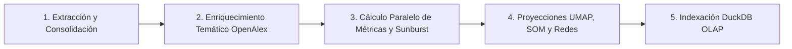

# Análisis Bibliométrico y Cienciométrico (Revistas LATAM)

Plataforma integral de recolección, procesamiento y visualización de datos bibliométricos a gran escala sobre la ciencia latinoamericana, impulsada por **OpenAlex**, **DuckDB**, **FastAPI** y **React 18 / Vite**. 

Su objetivo principal es evaluar el impacto, la soberanía editorial del Acceso Abierto Diamante y la evolución de la producción científica en América Latina e Iberoamérica a través de indicadores cienciométricos avanzados (FWCI, Percentiles, Índice H, Multilingüismo) y representaciones visuales interactivas (Scimago Graphica + WebGL GPU).

---

## 🌐 Despliegue Oficial
El sistema se encuentra desplegado y accesible en:
- **Servidor Principal**: [https://dinamica1.fciencias.unam.mx/revistaslatam/](https://dinamica1.fciencias.unam.mx/revistaslatam/)
- **Servidor Espejo**: [https://dinamica10.fciencias.unam.mx/revistaslatam/](https://dinamica10.fciencias.unam.mx/revistaslatam/)

---

## 🚀 Funcionalidades Principales

- **Ingesta y Extracción Masiva**: Procesamiento de más de 7,400 revistas y 3.63 millones de artículos científicos latinoamericanos.
- **Motor Cienciométrico OLAP**: Cálculo de indicadores de impacto ponderado por campo (FWCI), percentiles normalizados, cohorte Top 10% / Top 1%, Índices H e i10, y tasas de acceso abierto (Diamante vs Gold comercial).
- **Cartografía Semántica Trilingüe (UMAP 2D)**: Proyección topológica continua del conocimiento científico regional mediante modelos Transformer neuronales (*Nomic Embed Text v2*) con filtros léxicos en Español, Portugués e Inglés.
- **Visualización Analítica Interactiva**:
  - **Panorama Regional**: Brechas históricas vs recientes (*Dumbbell Chart*), composición 100% de vías OA e idiomas, estructura jerárquica (*Sunburst 4 Niveles* y *Treemap*), flujo temporal de disciplinas (*Stream Graph*) y desviaciones (*Diverging Bars*).
  - **Nivel País**: Matrices de Especialización Científica (*Índice RCA 20×28*), gráficos de eje dual (Volumen vs FWCI), dispersión de revistas (*Beeswarm Plot*) y dinámicas de ranking (*Slope Chart*).
  - **Nivel Revista**: Ficha técnica editorial, perfiles de madurez (*Radar Chart 6D*), distribución real de citas y Ley de Lotka (*Box / Violin Plot*) y trayectoria cíclica (*Connected Scatter Plot*).
  - **Redes y Flujos**: Matriz de cooperación Sur-Sur (*Circular Chord*), canalización disciplinar (*Diagrama Alluvial*) y arcos geográficos de coautoría global.
  - **Mapas Semánticos**: Renderizado de hasta 100,000 puntos en WebGL GPU acelerado a 60 FPS y delimitación territorial mediante *Envolturas Convexas (Convex Hulls)*.

---

## 🛠️ Instalación

### 1. Clonar el repositorio y configurar el entorno Python:
```bash
git clone https://github.com/chilti/revistas_latam.git
cd revistas_latam

# Crear y activar entorno virtual
python -m venv .venv
# Windows:
.venv\Scripts\activate
# Linux/Mac:
source .venv/bin/activate

# Instalar dependencias backend y pipelines
pip install -r requirements.txt
```

### 2. Instalar dependencias del Frontend (React / Vite):
```bash
cd frontend
npm install
cd ..
```

---

## ⚙️ Procesamiento y Pipeline Maestro de Datos

Toda la recolección, cálculo de métricas, proyecciones topológicas y consolidación OLAP se orquestan de manera automatizada mediante el **Pipeline Maestro**: `pipeline_revistaslatam/run_pipeline.py`.



### Ejecución del Pipeline Maestro

#### Opción 1: Ejecución Completa de Extremo a Extremo
Ejecuta todas las fases desde la ingesta de datos hasta la creación de la base analítica DuckDB:
```bash
python pipeline_revistaslatam/run_pipeline.py
```

#### Opción 2: Modo Sólo Cálculo (`--only-compute`) ⭐ Recomendado para Actualizaciones Analíticas
Recalcula todas las métricas anuales, periodos recientes, indicadores jerárquicos, mapas UMAP/SOM y la base DuckDB utilizando los datos Parquet locales existentes:
```bash
python pipeline_revistaslatam/run_pipeline.py --only-compute
```

#### Opciones Adicionales de Ejecución:
- `--skip-extraction`: Omite la descarga de base de datos y procesa directamente los archivos Parquet en `data/`.
- `--skip-maps`: Ejecuta el cálculo de indicadores analíticos omitiendo el entrenamiento de mapas UMAP/SOM (ideal para pruebas ultrarrápidas).

---

## 🌐 Ejecución de la Plataforma Web

### Modo Producción (Recomendado)
Inicia el servidor REST de alto rendimiento en FastAPI, sirviendo la API DuckDB y la SPA de React compilada:
```bash
# Compilar el bundle del frontend (si hubo cambios en React)
cd frontend && npm run build && cd ..

# Iniciar servidor unificado
uvicorn api.main:app --host 0.0.0.0 --port 8000
```
- 🖥️ **Acceso Web**: `http://localhost:8000`
- 📖 **Documentación Swagger API**: `http://localhost:8000/docs`

### Modo Desarrollo
Para desarrollo interactivo con recarga en caliente (*Hot Module Replacement*):
```bash
# Terminal 1: Backend FastAPI
uvicorn api.main:app --reload --port 8000

# Terminal 2: Frontend React + Vite
cd frontend
npm run dev
```

---

## 📂 Estructura del Repositorio

```text
revistaslatam/
├── api/                             # Backend REST API (FastAPI + DuckDB)
│   ├── main.py                      # Punto de entrada de la API y servidor estático
│   ├── db.py                        # Capa de acceso DuckDB y Parquet OLAP
│   ├── constants.py                 # Catálogos de países, coordenadas y paletas
│   └── routers/                     # Endpoints analíticos desacoplados
│       ├── regional.py              # Endpoints macro y panorama regional
│       ├── countries.py             # Endpoints a nivel país y matriz RCA
│       ├── journals.py              # Endpoints a nivel revista, radar y boxplot
│       ├── networks.py              # Endpoints de redes, Chord y Alluvial
│       ├── maps.py                  # Endpoints de nubes de puntos y Convex Hull
│       └── reports.py               # Generación y exportación de dossiers
│
├── frontend/                        # Aplicación SPA (React 18 + Vite + Plotly + WebGL)
│   ├── src/
│   │   ├── pages/                   # Vistas principales (Regional, País, Revista, Redes, Mapas)
│   │   ├── components/              # Componentes UI (WebGLCanvas, PlotlyChart, KpiCard, Dossier)
│   │   └── store.js                 # Estado global de la aplicación (Zustand)
│   └── dist/                        # Bundle optimizado para producción
│
├── pipeline_revistaslatam/          # Pipeline Maestro y scripts de procesamiento
│   ├── run_pipeline.py              # Orquestador Maestro de 5 fases
│   ├── precompute_metrics_parallel.py # Motor paralelo de cálculo cienciométrico
│   ├── compute_topics_metrics_postgres.py # Métricas jerárquicas temáticas
│   ├── calculate_umap.py            # Variedades UMAP y baricentros
│   ├── build_networks.py            # Redes de coautoría y flujos
│   └── build_duckdb.py              # Consolidación e indexación OLAP DuckDB
│
├── data/                            # Almacén de datos y caché analítico
│   ├── revistaslatam.duckdb         # Base de datos analítica OLAP
│   ├── latin_american_works.parquet # Registro histórico de artículos
│   ├── latin_american_journals.parquet # Catálogo de revistas indexadas
│   ├── cache/                       # Métricas precacheadas y jerarquías
│   └── umap/                        # Coordenadas topológicas y paisajes
│
└── docs/                            # Documentación técnica y metodológica
    ├── inventario_completo_indicadores.md # Inventario exhaustivo de métricas y gráficos
    ├── METRICS_CALCULATION_GUIDE.md # Fórmulas cienciométricas detalladas
    └── INCREMENTAL_PROCESSING.md    # Arquitectura de procesamiento incremental
```

---

## 📝 Notas Técnicas
- **Compatibilidad**: Desarrollado con compatibilidad nativa para Windows y Linux.
- **Rendimiento**: DuckDB ejecuta consultas analíticas en memoria columnar con tiempos de respuesta inferiores a 15 ms.

---
Desarrollado para el análisis y fortalecimiento de la ciencia abierta en Latinoamérica. 🌎
