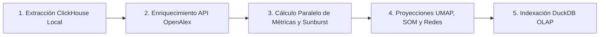

# Análisis Bibliométrico y Cienciométrico (Revistas LATAM)

[](https://doi.org/10.5281/zenodo.22679773)
[](https://opensource.org/licenses/MIT)

Plataforma integral de recolección, procesamiento y visualización de datos bibliométricos a gran escala sobre la ciencia latinoamericana, impulsada por **OpenAlex**, **DuckDB**, **FastAPI** y **React 18 / Vite**.

Su objetivo principal es evaluar el impacto, la soberanía editorial del Acceso Abierto Diamante y la evolución de la producción científica en América Latina e Iberoamérica a través de indicadores cienciométricos avanzados (FWCI, Percentiles, Índice H, Multilingüismo) y representaciones visuales interactivas.

---

## 🌐 Despliegue Oficial

El sistema se encuentra desplegado y accesible en:

- **Servidor Principal**: [https://dinamica1.fciencias.unam.mx/revistaslatam/](https://dinamica1.fciencias.unam.mx/revistaslatam/)
- **Servidor Espejo**: [https://dinamica10.fciencias.unam.mx/revistaslatam/](https://dinamica10.fciencias.unam.mx/revistaslatam/)

---

## 🚀 Funcionalidades Principales

- **Ingesta y Extracción Masiva**: Procesamiento de más de 7,400 revistas y 3.63 millones de artículos científicos latinoamericanos.
- **Motor Cienciométrico OLAP**: Cálculo de indicadores de impacto ponderado por campo (FWCI), percentiles normalizados, cohorte Top 10% / Top 1%, Índices H e i10, y tasas de acceso abierto (Diamante vs Gold comercial).
- **Internacionalización y Multilingüismo Nativo (i18n)**: Soporte trilingüe completo en **Español (ES 🇲🇽)**, **Portugués (PT 🇧🇷)** e **Inglés (EN 🇺🇸)** con conmutación en tiempo real en toda la interfaz (navegación, tooltips, métricas, tablas y dossiers) y análisis de soberanía lingüística en la producción científica.
- **Cartografía Semántica Trilingüe (UMAP 2D)**: Proyección topológica continua del conocimiento científico regional mediante modelos Transformer neuronales (*Nomic Embed Text v2*) con filtros léxicos en Español, Portugués e Inglés.
- **Visualización Analítica Interactiva**:
  - **Panorama Regional**: Brechas históricas vs recientes (*Dumbbell Chart*), composición 100% de vías OA e idiomas, estructura jerárquica (*Sunburst 4 Niveles* y *Treemap*), flujo temporal de disciplinas (*Stream Graph*) y desviaciones (*Diverging Bars*).
  - **Nivel País**: Matrices de Especialización Científica (*Índice RCA 20×28*), gráficos de eje dual (Volumen vs FWCI), dispersión de revistas (*Beeswarm Plot*) y dinámicas de ranking (*Slope Chart*).
  - **Nivel Revista**: Ficha técnica editorial, perfiles de madurez (*Radar Chart 6D*), distribución real de citas y Ley de Lotka (*Box / Violin Plot*) y trayectoria cíclica (*Connected Scatter Plot*).
  - **Redes y Flujos**: Matriz de cooperación Sur-Sur (*Circular Chord*), canalización disciplinar (*Diagrama Alluvial*) y arcos geográficos de coautoría global.
  - **Mapas Semánticos**: Renderizado de hasta 100,000 puntos en WebGL GPU acelerado a 60 FPS y delimitación territorial mediante *Envolturas Convexas (Convex Hulls)*.

---

## 🌍 Soporte Multilingüe e Internacionalización (i18n)

La plataforma fue diseñada considerando la pluralidad lingüística de América Latina e Iberoamérica y la necesidad de divulgar la ciencia regional a nivel internacional:

### 1. Idiomas Soportados en la Interfaz

- 🇲🇽 **Español (`es`)**: Idioma principal predeterminado de la plataforma.
- 🇧🇷 **Portugués (`pt`)**: Traducción terminológica completa adaptada a la comunidad científica de Brasil e Iberoamérica.
- 🇺🇸 **Inglés (`en`)**: Internacionalización integral para investigadores, evaluadores e instituciones globales.

### 2. Arquitectura del Módulo de Traducción (`frontend/src/i18n/`)

- **Conmutador Reactivo**: Selector segmentado en el encabezado (`Navbar`) con cambio instantáneo de idioma sin recarga de página.
- **Persistencia de Sesión**: La preferencia de idioma se almacena de forma persistente en `localStorage` (`rl_language`) mediante el store global de `Zustand`.
- **Diccionarios Desacoplados**: Archivos especializados (`es.js`, `pt.js`, `en.js`) que abarcan títulos, leyendas, tooltips de gráficos Plotly/WebGL, descripciones metodológicas, tablas interactivas y dossiers exportables.
- **Hook `useTranslation`**: Provee función `t(key, params)` con interpolación dinámica de variables y mecanismo de *fallback* automático al español ante claves no traducidas.

### 3. Métricas de Soberanía Lingüística

Además de la traducción de la interfaz, el sistema analiza cuantitativamente la distribución idiomática de la producción científica en Parquet/DuckDB:

- Indicadores de **% Español**, **% Portugués**, **% Inglés** y **% Otros Idiomas** en artículos y revistas.
- Gráficos de distribución lingüística a nivel regional, por país y por revista individual.
- Filtros léxicos trilingües integrados en el procesamiento de embeddings y cartografía semántica UMAP.

---

## 🛠️ Instalación

### 1. Clonar el repositorio y configurar el entorno Python:

```bash
git clone https://github.com/chilti/revistas_latam.git
cd revistas_latam

# Crear y activar entorno virtual
python -m venv .venv
# Windows:
.venv\Scripts\activate
# Linux/Mac:
source .venv/bin/activate

# Instalar dependencias backend y pipelines
pip install -r requirements.txt
```

### 2. Instalar dependencias del Frontend (React / Vite):

```bash
cd frontend
npm install
cd ..
```

### 3. Configuración de Variables de Entorno (`.env`):

Crea un archivo `.env` en la raíz del proyecto para la conexión a fuentes de datos y APIs (opcional si usas los archivos Parquet precacheados):

```dotenv
# Conexión a ClickHouse (Snapshot masivo de OpenAlex) - Requerido solo para Fase 1
CH_HOST=localhost
CH_PORT=8124
CH_USER=default
CH_PASSWORD=
CH_DATABASE=rag

# API de OpenAlex (Polite Pool - Requerido para enriquecimiento temático de Fase 2)
OPENALEX_EMAIL=tu_correo@institucion.edu.mx
```

---

## ⚙️ Procesamiento y Pipeline Maestro de Datos

Toda la recolección, cálculo de métricas, proyecciones topológicas y consolidación OLAP se orquestan de manera automatizada mediante el **Pipeline Maestro**: `pipeline_revistaslatam/run_pipeline.py`.



### 🗄️ Fuentes de Datos y Dependencias de Extracción

El pipeline maestro maneja una arquitectura híbrida para la adquisición y procesamiento de datos:

| Componente                                               | Fuente                                                | Rol en el Pipeline                                                                                                                                                    | Requisitos                                                                             |
| -------------------------------------------------------- | ----------------------------------------------------- | --------------------------------------------------------------------------------------------------------------------------------------------------------------------- | -------------------------------------------------------------------------------------- |
| **Extracción Masiva (Fase 1)**                    | **ClickHouse Local** (`localhost:8124`)       | Extracción veloz de más de**7,490 revistas** y **3.63 millones de artículos** latinoamericanos desde el snapshot completo de OpenAlex (569M trabajos). | Requiere ClickHouse con snapshot cargado o usar Parquet local (`--skip-extraction`). |
| **Enriquecimiento Temático (Fase 2)**             | **API Oficial OpenAlex** (`api.openalex.org`) | Descarga de jerarquía taxonómica (Tópicos → Subcampos → Campos → Dominios) para el diagrama Sunburst.                                                           | Conexión a internet y`OPENALEX_EMAIL` en `.env` (*Polite Pool* a 10 req/s).     |
| **Cálculo Analítico y Proyecciones (Fases 3-5)** | **Parquet & DuckDB** locales                    | Computación columnar de FWCI, percentiles, redes, mapas UMAP/SOM e indexación OLAP.                                                                                 | Totalmente local e independiente de servidores externos.                               |

> [!NOTE]
> **¿Se puede ejecutar directamente con la API pública de OpenAlex sin ClickHouse?**
>
> - **Extracción Masiva**: Técnicamente es posible consultar la API REST de OpenAlex para obras científicas (`https://api.openalex.org/works?filter=primary_location.source.id:...`), pero descargar y paginar **3.63 millones de registros completos** vía HTTP requeriría cientos de miles de peticiones y decenas de horas de transferencia continua, además de estar sujeto a límites de cuota diaria.
> - **Por qué ClickHouse local**: Permite extraer y consolidar los 3.63 millones de trabajos en cuestión de **minutos**, con compresión columnar y consultas SQL nativas.
> - **Modo Autónomo (Sin ClickHouse)**: Si no cuentas con la base local de ClickHouse (~500GB+), **no es necesario instalarla ni configurarla**: el repositorio incluye o provee los archivos Parquet consolidados en `data/` (`latin_american_works.parquet` y `latin_american_journals.parquet`). Ejecutando el pipeline con `--skip-extraction` o `--only-compute`, se generan todas las métricas, proyecciones UMAP/SOM y la base DuckDB sin requerir ClickHouse.

### Ejecución del Pipeline Maestro

#### Opción 1: Ejecución Completa de Extremo a Extremo

Ejecuta todas las fases desde la ingesta de datos hasta la creación de la base analítica DuckDB:

```bash
python pipeline_revistaslatam/run_pipeline.py
```

#### Opción 2: Modo Sólo Cálculo (`--only-compute`) ⭐ Recomendado para Actualizaciones Analíticas

Recalcula todas las métricas anuales, periodos recientes, indicadores jerárquicos, mapas UMAP/SOM y la base DuckDB utilizando los datos Parquet locales existentes:

```bash
python pipeline_revistaslatam/run_pipeline.py --only-compute
```

#### Opciones Adicionales de Ejecución:

- `--skip-extraction`: Omite la descarga de base de datos y procesa directamente los archivos Parquet en `data/`.
- `--skip-maps`: Ejecuta el cálculo de indicadores analíticos omitiendo el entrenamiento de mapas UMAP/SOM (ideal para pruebas ultrarrápidas).

---

## 🌐 Ejecución de la Plataforma Web

### Modo Producción (Recomendado)

Inicia el servidor REST de alto rendimiento en FastAPI, sirviendo la API DuckDB y la SPA de React compilada:

```bash
# Compilar el bundle del frontend (si hubo cambios en React)
cd frontend && npm run build && cd ..

# Iniciar servidor unificado
uvicorn api.main:app --host 0.0.0.0 --port 8000
```

- 🖥️ **Acceso Web**: `http://localhost:8000`
- 📖 **Documentación Swagger API**: `http://localhost:8000/docs`

### Modo Desarrollo

Para desarrollo interactivo con recarga en caliente (*Hot Module Replacement*):

```bash
# Terminal 1: Backend FastAPI
uvicorn api.main:app --reload --port 8000

# Terminal 2: Frontend React + Vite
cd frontend
npm run dev
```

---

## 📂 Estructura del Repositorio

```text
revistaslatam/
├── api/                             # Backend REST API (FastAPI + DuckDB)
│   ├── main.py                      # Punto de entrada de la API y servidor estático
│   ├── db.py                        # Capa de acceso DuckDB y Parquet OLAP
│   ├── constants.py                 # Catálogos de países, coordenadas y paletas
│   └── routers/                     # Endpoints analíticos desacoplados
│       ├── regional.py              # Endpoints macro y panorama regional
│       ├── countries.py             # Endpoints a nivel país y matriz RCA
│       ├── journals.py              # Endpoints a nivel revista, radar y boxplot
│       ├── networks.py              # Endpoints de redes, Chord y Alluvial
│       ├── maps.py                  # Endpoints de nubes de puntos y Convex Hull
│       └── reports.py               # Generación y exportación de dossiers
│
├── frontend/                        # Aplicación SPA (React 18 + Vite + Plotly + WebGL)
│   ├── src/
│   │   ├── pages/                   # Vistas principales (Regional, País, Revista, Redes, Mapas, Acerca de)
│   │   ├── components/              # Componentes UI (WebGLCanvas, PlotlyChart, KpiCard, Dossier, Navbar)
│   │   ├── i18n/                    # Módulo de internacionalización trilingüe (es.js, pt.js, en.js, index.js)
│   │   ├── api.js                   # Cliente de consumo para la API REST FastAPI
│   │   └── store.js                 # Estado global de la aplicación (Zustand + sincronización URL/localStorage)
│   └── dist/                        # Bundle optimizado para producción
│
├── pipeline_revistaslatam/          # Pipeline Maestro y scripts de procesamiento
│   ├── run_pipeline.py              # Orquestador Maestro de 5 fases
│   ├── precompute_metrics_parallel.py # Motor paralelo de cálculo cienciométrico
│   ├── compute_topics_metrics_postgres.py # Métricas jerárquicas temáticas
│   ├── calculate_umap.py            # Variedades UMAP y baricentros
│   ├── build_networks.py            # Redes de coautoría y flujos
│   └── build_duckdb.py              # Consolidación e indexación OLAP DuckDB
│
├── data/                            # Almacén de datos y caché analítico
│   ├── revistaslatam.duckdb         # Base de datos analítica OLAP
│   ├── latin_american_works.parquet # Registro histórico de artículos
│   ├── latin_american_journals.parquet # Catálogo de revistas indexadas
│   ├── cache/                       # Métricas precacheadas y jerarquías
│   └── umap/                        # Coordenadas topológicas y paisajes
│
└── docs/                            # Documentación técnica y metodológica
    ├── inventario_completo_indicadores.md # Inventario exhaustivo de métricas y gráficos
    ├── METRICS_CALCULATION_GUIDE.md # Fórmulas cienciométricas detalladas
    └── INCREMENTAL_PROCESSING.md    # Arquitectura de procesamiento incremental
```

---

## 📝 Notas Técnicas

- **Compatibilidad**: Desarrollado con compatibilidad nativa para Windows y Linux.
- **Rendimiento**: DuckDB ejecuta consultas analíticas en memoria columnar con tiempos de respuesta inferiores a 15 ms.

---

## 📖 Cómo Citar este Software (Citation)

Si utilizas **Revistas LATAM** en tus investigaciones, estudios cienciométricos o desarrollos, por favor cita el software de la siguiente manera:

> **Jiménez Andrade, J. L., Carrillo Calvet, H. A., & Arencibia Jorge, R. (2026). Revistas LATAM: Plataforma de Inteligencia Cienciométrica y Acceso Abierto (Version v2.0.0) [Computer software]. Zenodo. [https://doi.org/10.5281/zenodo.22679773](https://doi.org/10.5281/zenodo.22679773)**

### Formato BibTeX:
```bibtex
@software{jimenez_andrade_2026_22679773,
  author       = {Jiménez Andrade, José Luis and Carrillo Calvet, Humberto Andrés and Arencibia Jorge, Ricardo},
  title        = {Revistas LATAM: Plataforma de Inteligencia Cienciométrica y Acceso Abierto},
  month        = sep,
  year         = 2026,
  publisher    = {Zenodo},
  version      = {v2.0.0},
  doi          = {10.5281/zenodo.22679773},
  url          = {https://doi.org/10.5281/zenodo.22679773}
}
```

---

## ℹ️ Acerca de Revistas LATAM

El proyecto **Revistas LATAM** es un desarrollo de ciencia abierta enfocado en la evaluación cienciométrica de las revistas académicas de América Latina y el Caribe. Todos los scripts de recolección, pipelines de cálculo, modelos de reducción topológica (UMAP) y el código de la plataforma web están disponibles públicamente bajo principios de reproducibilidad y soberanía editorial.

### 👥 Grupo de Trabajo

**Complejidad, Cienciometría y Ciencia de la Ciencia** — *Facultad de Ciencias / Centro de Ciencias de la Complejidad (C3), Universidad Nacional Autónoma de México (UNAM)*

- **Dr. José Luis Jiménez Andrade** — *Arquitectura y Modelado Matemático (Facultad de Ciencias & C3, UNAM)*  
  [](https://orcid.org/0000-0003-3453-7159)
- **Dr. Humberto Andrés Carrillo Calvet** — *Investigador Titular (Facultad de Ciencias & C3, UNAM)*  
  [](https://orcid.org/0000-0003-3659-6769)
- **Dr. Ricardo Arencibia Jorge** — *Especialista Cienciométrico (Centro de Ciencias de la Complejidad - C3, UNAM)*  
  [](https://orcid.org/0000-0001-8907-2454)

### 💻 Desarrollo, ETL e Ingeniería de Software

- **Dr. José Luis Jiménez Andrade**: Arquitectura del Sistema, Pipelines ETL y Modelado Topológico.
- **Antigravity con Gemini 3 Pro y Claude Sonnet 4.5**: Pair Programming, Optimización DuckDB, Canvas 2D y WebGL GPU.

### 🏛️ Arquitectura del Sistema Desacoplado (2.0)

1. **Capa de Datos**: OpenAlex Snapshot Global + PostgreSQL + ClickHouse local (569M trabajos, 337M autores).
2. **Motor Analítico OLAP**: DuckDB embebido con almacenamiento columnar Parquet (3.63M trabajos LATAM / 7,494 revistas).
3. **Backend REST**: FastAPI asíncrono con compresión Gzip, endpoints analíticos < 15 ms y servicio de archivos estáticos.
4. **Frontend SPA**: React 18 + Vite + Plotly.js + Canvas 2D Heatmaps + Shaders WebGL GPU a 60 FPS.
5. **Inteligencia Artificial**: Exportador estructurado de Dossier de Estudio para integración fluida con ChatGPT / LLMs.

### 🔬 Metodología Cienciométrica y Soberanía Editorial

El sistema implementa un pipeline de inteligencia científica para cartografiar el ecosistema de revistas académicas en América Latina. A través de modelos neuronales de lenguaje y reducción topológica no lineal (**UMAP**), se proyecta la variedad semántica pura del conocimiento regional sin sesgos institucionales ni geopolíticos.

Las métricas de citación e impacto normalizado por campo (**FWCI**), la clasificación en percentiles mundiales (**Top 1%** y **Top 10%**) y el seguimiento exhaustivo de las vías de **Acceso Abierto Diamante y Dorado** permiten una evaluación integral, justa y transparente de las publicaciones académicas latinoamericanas.

### 🙏 Agradecimientos
Nuestro especial reconocimiento y agradecimiento a **Romel Calero Ramos**, por el diseño, despliegue y administración de la infraestructura de servidores y base de datos analítica masiva en **ClickHouse** en el **Centro de Ciencias de la Complejidad (C3, UNAM)**, pilar fundamental para el procesamiento y consulta a gran escala de los datos de este proyecto.

---

Desarrollado para el análisis y fortalecimiento de la ciencia abierta en Latinoamérica. 🌎
