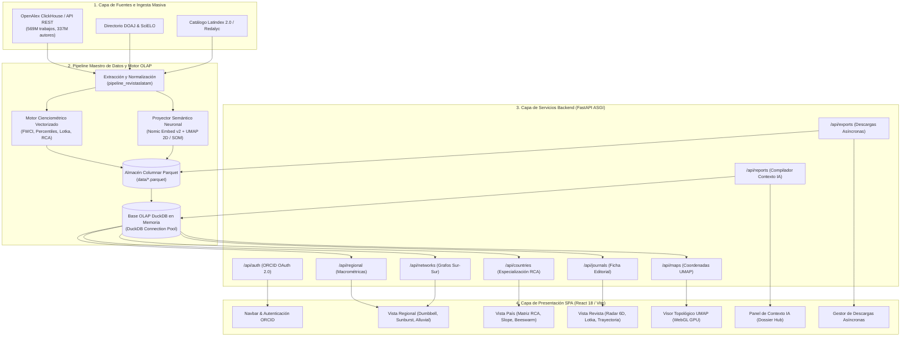
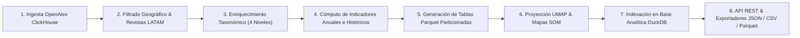
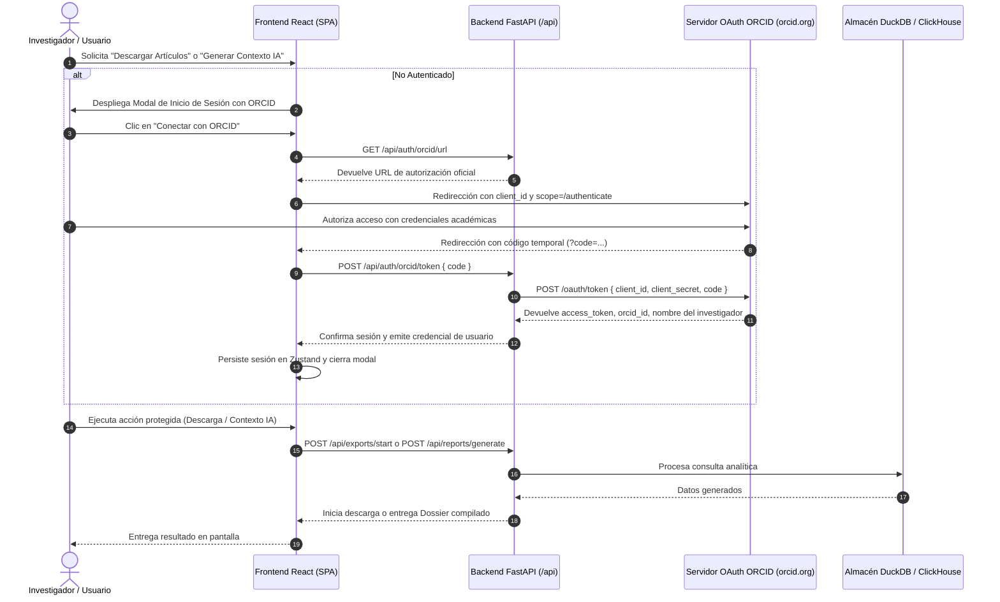

# Arquitectura de Software y Modelo de Datos del Ecosistema Revistas LATAM

**Autores:** Laboratorio de Inteligencia Cienciométrica y Sistemas Complejos  
**Fecha:** Septiembre de 2026  
**Ecosistema:** Revistas LATAM (OpenAlex + DuckDB OLAP + React 18 / Vite + ORCID OAuth 2.0)  
**Clasificación:** Arquitectura de Software Científico / Cienciometría Computacional  

---

## Resumen Ejecutivo

El ecosistema **Revistas LATAM** es una plataforma de analítica cienciométrica de alto rendimiento diseñada para la caracterización, evaluación de soberanía editorial y cartografía topológica de la producción científica publicada en más de 7,400 revistas científicas de América Latina y el Caribe indizadas en el grafo global de conocimiento OpenAlex (3.63 millones de artículos). 

La plataforma aborda la heterogeneidad de fuentes y la brecha en la representación del **Acceso Abierto Diamante** (sin cobro de APC a autores ni lectores) frente a los modelos comerciales dominantes (Gold/Hybrid). Integra un pipeline de ingesta paralela, un motor de procesamiento analítico en línea (**OLAP**) basado en **DuckDB** y archivos particionados **Parquet**, un motor de aprendizaje de variedades para proyecciones semánticas 2D (**UMAP** y **Kohonen SOM**) con embeddings neuronales trilingües, una capa de microservicios en **FastAPI** y una interfaz de usuario interactiva (**SPA en React 18**) con renderizado acelerado por GPU vía **WebGL**.

---

## 1. Diagrama General de Arquitectura por Capas

La arquitectura del sistema sigue un patrón desacoplado multi-capa optimizado para consultas de agregación a escala de millones de registros en subsegundos:

---

## 2. Diagrama de Flujo del Pipeline de Datos

El procesamiento analítico se ejecuta de forma reproducible mediante el pipeline maestro:

---

## 3. Desglose Exhaustivo de Módulos del Sistema

### 3.1. Módulo de Ingesta y Extracción Masiva (`pipeline_revistaslatam/`)
- **Extracción Geoespacial**: Filtra fuentes registradas en los 20 países de América Latina e Iberoamérica, recuperando metadatos completos: identificadores OpenAlex (`S...`, `W...`), títulos normalizados, ISSN-L, ISSN electrónico/impreso, tipos de acceso abierto y políticas de APC.
- **Normalización y Manejo de Diacríticos**: Estandarización de variantes lingüísticas mediante tokenización insensible a mayúsculas/minúsculas y acentos (`positionCaseInsensitiveUTF8`).

### 3.2. Módulo de Métricas Cienciométricas y Soberanía Editorial (`api/routers/`)
- **Impacto Ponderado por Disciplina (FWCI)**: Cálculo del *Field-Weighted Citation Impact* comparando el volumen de citas recibido contra la media mundial esperada por subcampo y año de publicación.
- **Distribución de Citas y Ley de Lotka**: Modelado probabilístico del sesgo de distribución de citas mediante curvas de Pareto y ajuste exponencial sobre el histórico de artículos.
- **Ventaja Comparativa Revelada (Índice RCA)**: Matriz de especialización temática de Balassa ($RCA > 1$) aplicada a 20 países sobre las 28 disciplinas científicas canónicas.
- **Acceso Abierto Diamante vs Comercial**: Cuantificación de tasas de publicación bajo modelos Diamante (SciELO, Redalyc, repositorios institucionales) frente a vías con cobro de APC (Gold/Hybrid).
- **Índice de Diversidad Lingüística (Gini-Simpson)**: Coeficiente de balance de publicación entre Español, Portugués e Inglés en el corpus editorial regional.

### 3.3. Módulo de Variedades Semánticas y Cartografía Neuronal (`src/`)
- **Representación Vectorial Densa**: Extracción de embeddings mediante el modelo neuronal de lenguaje *Nomic Embed Text v2 MoE* adaptado a textos científicos trilingües.
- **Reducción Topológica UMAP 2D**: Preservación de estructuras locales y globales del espacio semántico multidimensional, proyectando los artículos a coordenadas cartesianas continuas.
- **Envolturas Convexas (Convex Hulls)**: Delimitación de fronteras disciplinares y trayectorias temáticas longitudinales por revista a lo largo de décadas.

### 3.4. Módulo de Base de Datos Analítica OLAP (`api/db.py`)
- **DuckDB Connection Pool**: Motor analítico vectorial embebido que ejecuta agregaciones agrupadas (`GROUP BY`, sumas ponderadas, percentiles exactos) sobre archivos Parquet sin intermediarios de red ni bloqueo de concurrencia.
- **Tablas Parquet Estructuradas**: `journals_profile.parquet`, `annual_metrics.parquet`, `countries_summary.parquet`, `thematic_sunburst.parquet` y `umap_embeddings.parquet`.

### 3.5. Módulo de Microservicios Backend (`api/main.py` y `api/routers/`)
- **FastAPI / ASGI**: Servidor no bloqueante de alto rendimiento.
- **Gestor de Exportaciones Asíncronas (`exports.py`)**: Arquitectura concurrente basada en `ThreadPoolExecutor` para descargar y serializar miles de registros de OpenAlex en segundo plano (formatos JSON completo, JSONL y CSV de 88 columnas para *knoMap*).
- **Compilador de Contexto IA / Dossier (`reports.py`)**: Ensamblador de evidencia cienciométrica en Markdown estructurado y JSON para agentes conversacionales y modelos LLM.

### 3.6. Módulo de Interfaz SPA y Visualización GPU (`frontend/src/`)
- **React 18 + Vite**: Componentes modulares con reactividad declarativa y transiciones fluidas.
- **Zustand State Store**: Gestión global de estado para tema (Claro / Oscuro / Navy), revista activa, país seleccionado, canasta del Dossier y cola de descargas.
- **Biblioteca de Visualizaciones Híbridas**:
  - *Dumbbell Charts* (brecha temporal histórica vs reciente).
  - *Sunburst 4 Niveles* (jerarquía Dominio $\rightarrow$ Campo $\rightarrow$ Subcampo $\rightarrow$ Tópico).
  - *Alluvial Diagrams & Circular Chords* (flujo Sur-Sur y canalización disciplinar).
  - *Radar Chart 6D* (perfil de madurez editorial).
  - *WebGL GPU Scatterplot* (exploración fluida de 100,000+ puntos semánticos).

---

## 4. Diagrama de Secuencia: Autenticación ORCID y Control de Acceso

La interacción con servicios avanzados (Contexto IA y Descarga Masiva de Artículos) está protegida mediante el estándar **ORCID OAuth 2.0**:

---

## 5. Especificación de Endpoints REST Principales

| Método | Endpoint | Descripción | Acceso |
| :--- | :--- | :--- | :--- |
| `GET` | `/api/health` | Estado del servicio y tiempo de actividad | Público |
| `GET` | `/api/regional/summary` | Indicadores globales de la región LATAM | Público |
| `GET` | `/api/countries/{code}` | Ficha analítica y matriz RCA del país | Público |
| `GET` | `/api/journals/{id}/details` | Perfil cienciométrico 6D de la revista | Público |
| `GET` | `/api/maps/umap` | Coordenadas 2D y particiones semánticas | Público |
| `GET` | `/api/auth/orcid/url` | Generador de URL para flujo OAuth 2.0 | Público |
| `POST` | `/api/auth/orcid/token` | Intercambio de código por token ORCID | Público |
| `GET` | `/api/auth/me` | Validación de sesión del investigador | Autenticado |
| `POST` | `/api/exports/start` | Inicio de tarea de exportación masiva | Autenticado con ORCID |
| `POST` | `/api/reports/generate` | Compilación de Dossier para contexto IA | Autenticado con ORCID |

---

## 6. Conclusiones y Relevancia Científica

La arquitectura de **Revistas LATAM** proporciona un marco computacional abierto, reproducible y escalable para la evaluación de la ciencia latinoamericana. Al integrar bases de datos columnares analíticas (**DuckDB**), grafos de conocimiento (**OpenAlex**) e inteligencia artificial generativa y topológica (**Embeddings neuronales y LLMs**), la plataforma democratiza el acceso a métricas complejas y garantiza la soberanía del conocimiento científico en Acceso Abierto.
