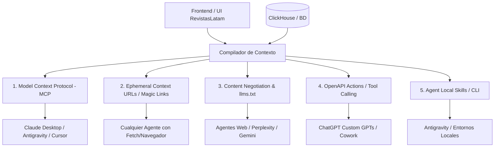

# Patrones de Integración y Consumo de Contexto para Agentes de IA

Este documento describe y compara los patrones de arquitectura de software y estándares de la industria para permitir que agentes de IA (Claude Desktop, Antigravity, Cowork, Cursor, Custom GPTs, etc.) consuman de forma directa, programática o efímera el contexto generado por **revistaslatam** (compilador de contexto, métricas e información de revistas).

---

## 1. Panorama de Patrones

---

## 2. Descripción Detallada de Patrones

### Patrón 1: Model Context Protocol (MCP)
**Estándar de la industria impulsado por Anthropic** para conectar asistentes de IA a sistemas de datos locales o remotos.

* **Conceptos Clave**:
  * **Resources**: URIs leíbles por el agente (ej. `revistaslatam://journal/{id}/context.md`).
  * **Tools**: Funciones invocables con JSON Schema (ej. `get_journal_context(journal_id, metric_types)` o `search_journals(query)`).
  * **Prompts**: Plantillas preconfiguradas para guiar el análisis del agente.
* **Mecanismos de Transporte**:
  * *stdio* (proceso local en Python/Node iniciado por el cliente de escritorio).
  * *SSE / Stream* (servidor HTTP remoto expuesto).
* **Compatibilidad**: Claude Desktop, Antigravity, Cursor, Zed, Continue.dev, frameworks agénticos.
* **Ventajas**:
  * Integración nativa bidireccional en clientes de escritorio.
  * El agente decide cuándo y cómo consultar datos según el flujo de la conversación.

---

### Patrón 2: Ephemeral Context URLs / Magic Links (`.md` con TTL)
Patrón estilo *Pastebin/Gist para LLMs* basado en enlaces temporales o snapshots.

* **Flujo**:
  1. El usuario selecciona métricas y compila el contexto en la UI de revistaslatam.
  2. Al pulsar *"Compartir con Agente"*, el backend almacena el bundle de Markdown en Redis/BD con un TTL (ej. 24 a 48 horas) y genera un token único.
  3. Se genera un enlace accesible públicamente o protegido por token:
     `https://revistaslatam.org/ai/c/8f9a2b1c.md`
  4. El endpoint sirve contenido `text/markdown` plano optimizado para tokenizadores (sin HTML, JS ni hojas de estilo).
  5. El usuario envía el enlace a cualquier agente (ChatGPT, Claude Web, Cowork, Antigravity):
     > *"Analiza la revista en https://revistaslatam.org/ai/c/8f9a2b1c.md y responde..."*
* **Compatibilidad**: **100% universal** para cualquier agente con capacidades de lectura HTTP/web.
* **Ventajas**:
  * Cero configuración de clientes o instalación de plugins.
  * Bajo costo de infraestructura (Redis con expiración automática).

---

### Patrón 3: `llms.txt` y Content Negotiation (HTTP Header `Accept`)
Evolución del estándar web para hacer aplicaciones amigables para modelos de lenguaje.

* **Componentes**:
  * **/llms.txt**: Archivo raíz que define la descripción del sistema, enlaces a la documentación y endpoints de datos optimizados.
  * **/llms-full.txt**: Catálogo consolidado o resumen estructurado para consumo directo.
  * **Content Negotiation (`Accept: text/markdown`)**:
    * Si un navegador solicita `GET /journal/123` con `Accept: text/html` $\rightarrow$ Recibe la vista React/HTML.
    * Si un LLM o agente solicita `GET /journal/123` con `Accept: text/markdown` $\rightarrow$ El backend devuelve directamente el Markdown compilado.
* **Compatibilidad**: Agentes con navegación web, bots de indexación de IA, herramientas como Perplexity o Gemini.
* **Ventajas**:
  * Transparente; no requiere rutas ni identificadores efímeros adicionales para datos públicos.

---

### Patrón 4: OpenAPI Actions (Custom GPTs / Plugin Architecture)
Patrón basado en especificaciones formales de API (OpenAPI 3.0/3.1).

* **Flujo**:
  1. Se publica un esquema formal en `/api/v1/openapi.json`.
  2. Se expone un endpoint dedicado como:
     `GET /api/v1/ai/context?issn={issn}&sections={sections}`
  3. En plataformas como ChatGPT (Custom GPTs) o Cowork se registra la URL del schema OpenAPI.
  4. El LLM genera los parámetros y consume la API vía llamadas HTTP estructuradas.
* **Compatibilidad**: ChatGPT Custom GPTs, LangChain/LangGraph, Cowork, AutoGen.
* **Ventajas**:
  * Estructura rígida y validación tipada de parámetros mediante JSON Schema.

---

### Patrón 5: Agent Local Skills / CLI Integration
Patrón orientado a entornos de ejecución local (terminales, IDEs, Antigravity, Claude Code).

* **Componentes**:
  * Archivo de definición `.agents/skills/revistaslatam/SKILL.md` o plugin.
  * CLI local o script Python (ej. `python -m src.cli.export_context --issn ...`).
* **Compatibilidad**: Antigravity, OpenDevin, Claude Code, Aider.
* **Ventajas**:
  * Ejecución directa en local sin necesidad de exponer endpoints públicos.

---

## 3. Matriz Comparativa

| Criterio | 1. Servidor MCP | 2. URL Temporal (`.md`) | 3. `llms.txt` / Content Neg. | 4. OpenAPI Actions | 5. Skill / CLI Local |
| :--- | :--- | :--- | :--- | :--- | :--- |
| **Clientes Soportados** | Claude Desktop, Antigravity, Cursor | Todos (ChatGPT, Claude, Cowork) | Agentes Web (Perplexity, etc.) | Custom GPTs, Cowork | Antigravity, Claude Code |
| **Complejidad Dev** | Media (FastMCP / Python) | Baja (Endpoint GET + TTL) | Baja (Headers / Template) | Media (OpenAPI spec) | Baja (Markdown + Script) |
| **Requiere Setup Usuario** | Sí (agregar a config MCP) | No (copiar enlace) | No (automático) | Sí (crear GPT/acción) | Sí (añadir a workspace) |
| **Privacidad / Seguridad** | Alta (local o autenticado) | Media (Token / TTL efímero) | Pública | Alta (API Keys / OAuth) | Alta (Local) |
| **Granularidad de Datos** | Dinámica y bajo demanda | Fija al momento de compilar | Predefinida por URL pública | Dinámica por parámetros | Total (acceso a scripts) |

---

## 4. Hoja de Ruta de Implementación Sugerida

### Fase 1: Enlaces Efímeros en Markdown (Rápido y Universal)
1. Crear tabla o clave en Redis `ai_context:{token}` con expiración (ej. 24h).
2. Endpoint `POST /api/ai/context/share` $\rightarrow$ Devuelve `https://revistaslatam.org/ai/c/:token.md`.
3. Endpoint `GET /ai/c/:token.md` $\rightarrow$ Retorna el Markdown compilado con `Content-Type: text/markdown; charset=utf-8`.
4. Botón en frontend: *"Copiar enlace para Agente de IA"*.

### Fase 2: Model Context Protocol (MCP) Server
1. Implementar un servidor ligero utilizando `mcp` (Python SDK / `fastmcp`).
2. Exponer herramientas:
   * `search_journals(query)`
   * `get_journal_metrics(issn, years)`
   * `compile_journal_context(issn, options)`
3. Permitir conexión local (`stdio`) para Claude Desktop y Antigravity, o remoto (`SSE`) para despliegue en servidor.

### Fase 3: Estandarización Web (`llms.txt` + Content Negotiation)
1. Publicar `https://revistaslatam.org/llms.txt` con la estructura del repositorio de métricas.
2. Soportar cabecera `Accept: text/markdown` en las rutas de consulta de revistas.
